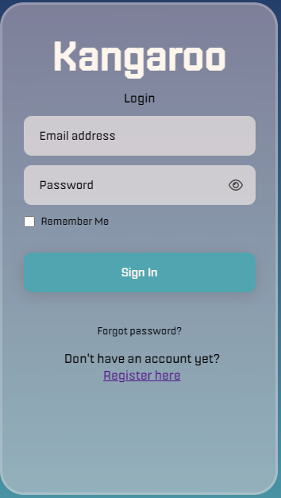
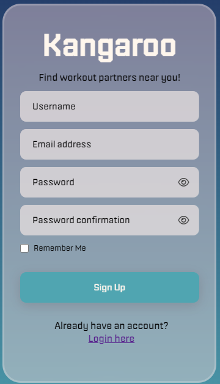
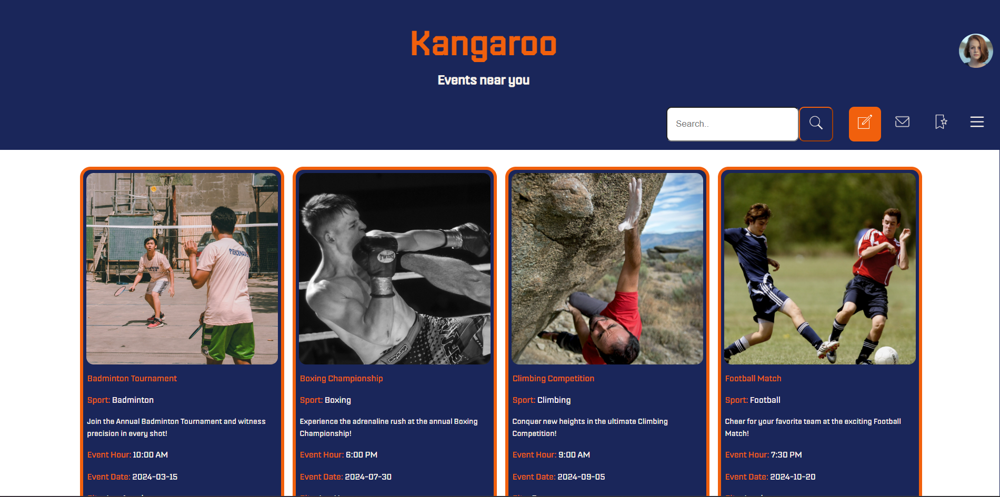
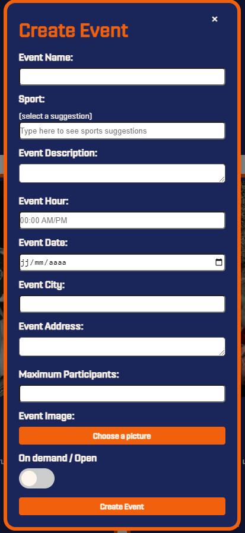
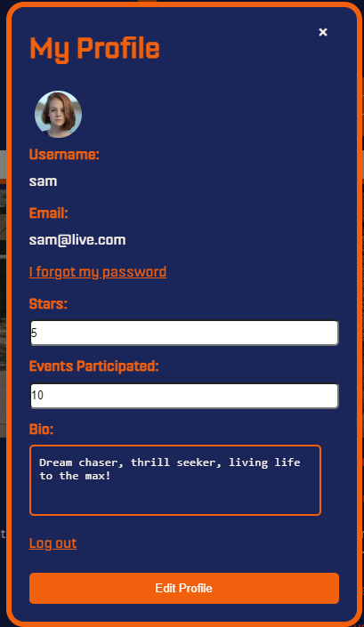
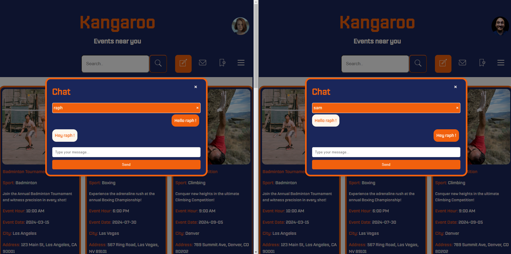
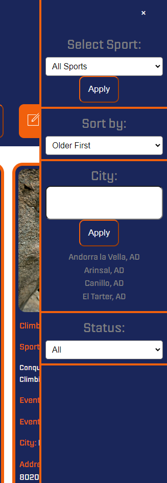

# Portfolio Project 

<div align="center">
    <h1>Kangaroo</h1>
</div>

---


## Introduction
Welcome to Kangaroo ! Our platform is designed to revolutionize the way sports enthusiasts engage with their favorite events. Whether you're a seasoned athlete or a passionate spectator, Kangaroo is here to enhance your experience every step of the way.

Our mission is simple: to provide a comprehensive and user-friendly platform that caters to all your sports meeting needs. With real-time event updates we're committed to ensuring that your journey with us is seamless and enjoyable.

With innovative features and a vibrant community of sports enthusiasts, Kangaroo  is your ultimate companion for staying informed, connected, and inspired throughout the sports meeting season. Join us and elevate your sports experience like never before!

---


## Usage

- **Search Functionality**: Allows users to search for specific content within the application. It listens for input events in search fields and filters the displayed content based on the search term.

- **Filters**:
  - **Sport Filter**: Fetches a list of sports from the server and populates a dropdown/select element with the sports. Users can filter events based on selected sports.
  - **Date Sorting**: Allows sorting events by date in ascending or descending order.
  - **City Filter**: Fetches city data from the server and provides autocomplete suggestions as users type in the city input field. Events can be filtered based on selected cities.
  - **Status Filter**: Checks the status of an event to determine whether it is "all", "open", or "demand".
    - **All**: Shows all events, regardless of their status.
    - **Open**: Displays events that are currently open and available for participation.
    - **Demand**: Filters events that have pending requests or demands from participants awaiting approval or processing.
    
- **Chat Box**:
  - Enables users to communicate with each other via a chat interface.
  - Retrieves user information and messages from the server.
  - Handles message sending, receiving, and rendering.
  - Provides functionality to load messages for selected users and display user lists for initiating conversations.

- **Participate in Event**:
  - Enables users to participate in events.
  - Handles participation requests and communication with event creators.
  - Provides functionality to accept or reject participation requests.

---

## Prerequisites
Before you begin, ensure you have met the following requirements:
- Git must be installed on your operating system. [Download Git](https://git-scm.com/downloads)

---

## Run Locally
To run the portfolio locally, run the following command on your git bash:

### Linux and macOS:
```bash
sudo git clone https://github.com/RaphSchp/PortfolioProject.git
```
### Windows:

```bash
git clone https://github.com/RaphSchp/PortfolioProject.git
```
---

### System Information
```
Ubuntu 22.04.3 LTS
```

### Installing Node Version Manager (NVM)
You can install NVM (Node Version Manager) from <a href="https://nodejs.org/en">here</a>.

After installing Node.js, make sure to switch to version 16.20.1 using the following command:

```bash
nvm use 16.20.1
```

### Download MongoDB
You can download MongoDB from <a href="https://www.mongodb.com/try/download/community">here</a>


### Installing Dependencies
```bash
npm install $(cat requirements.txt)
```
---
## Screenshots

### Login / Register



### Homepage


### Create Event


### Profile Box


### Chat Box


### Filters


### Request


### Demo


---

# License
This project is licensed under the <a href="https://github.com/RaphSchp/PortfolioProject/blob/backend/LICENSE"> "Read Only Software License".</a>

# Contact
For any inquiries or support, please contact <a href="https://github.com/RaphSchp">RaphSchp</a>.